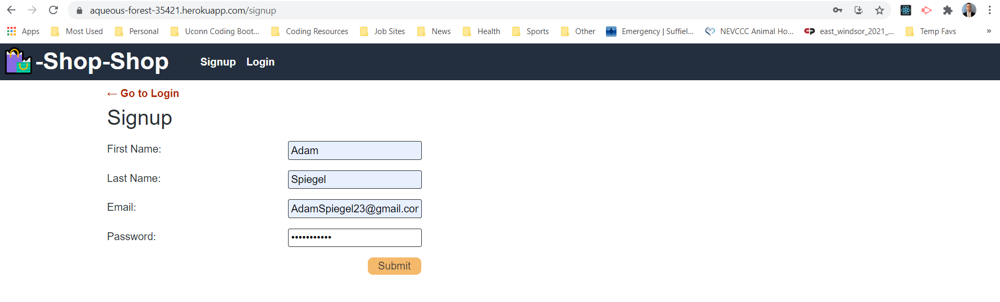
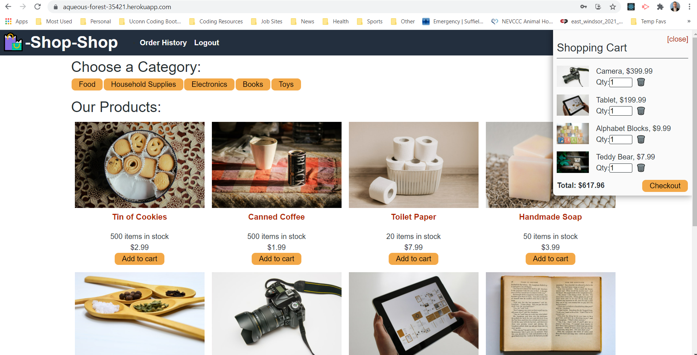
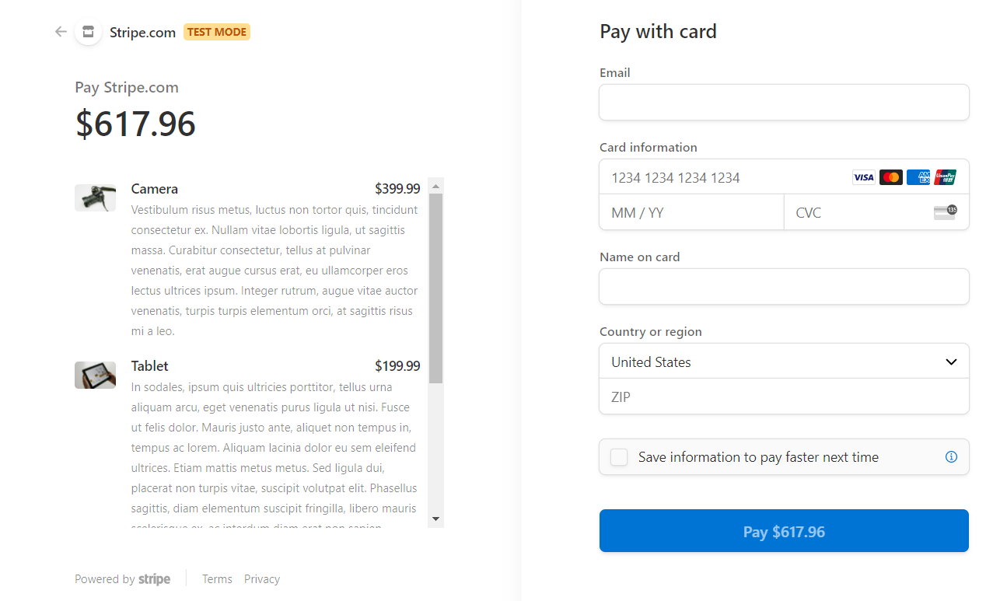
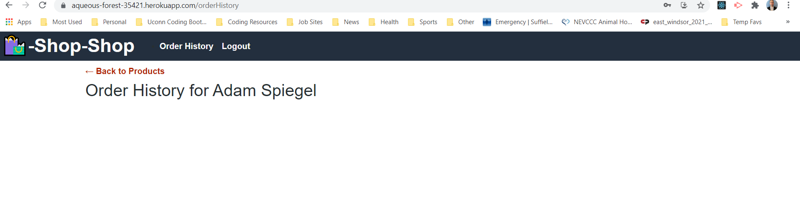
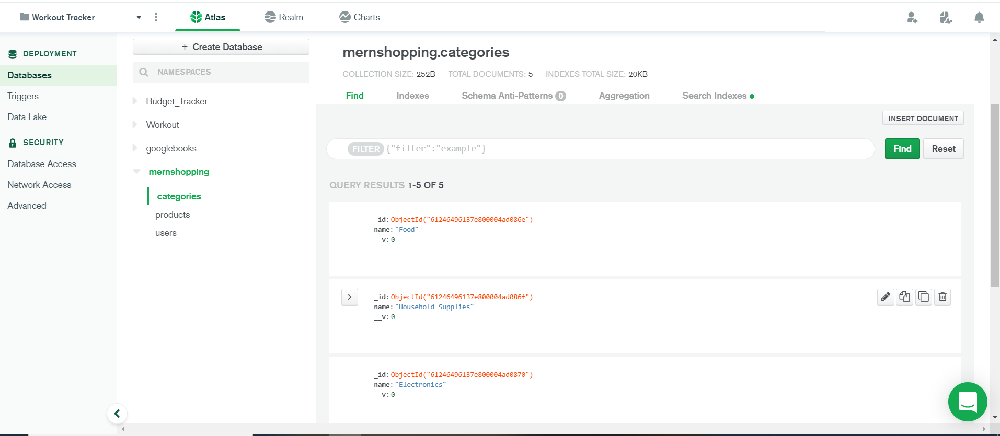
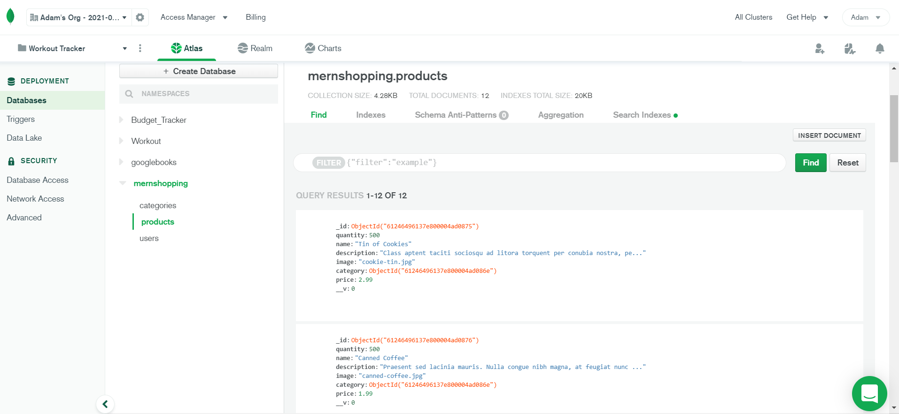
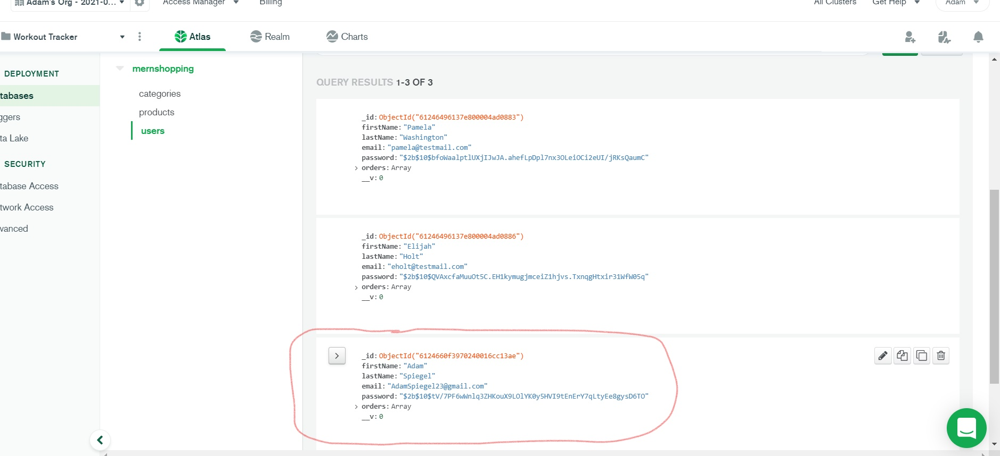

# Redux Store - Shop Shop 🛍️💻👜

## Table of Contents 🗂️📂

1.  [Description](#Description)
2.  [Installation](##Installation)
3.  [Project Usage](#Project-Usage)
4.  [License Information](#License-Information)
5.  [Testing Instructions](#Testing-Instructions)
6.  [Heroku Application Link](#Heroku-Application-Link)
7.  [Contributors](##Project-Contributors)
8.  [Contact Info](#Questions)
9.  [Screenshots](#Screenshots)

 

## Description 💰📚📷🧼🧻🧸

An e-commerce platform, refactored so that is utilizes Redux. As a senior engineer working on an e-commerce platform I want my platform to use Redux to manage global state instead of the Context API so that my website's state management is taken out of the React ecosystem.

 

## Installation 🛠️🧰

### _Application Dependencies Include_

- React
- Redux
- Stripe
- bcrypt
- Mongoose
- Express
- React (-dom/router-dom/-scripts)
- Node.js
- Apollo-Server
- Apollo-Server-Express
- GraphQL
- Json Web Token
- Heroku

 

### _Additional Install Instructions & Tools Include_

- Clone code to local machine.
- Run NPM Install to utilize package.json dependencies.
- Run 'NPM Run Seed' to populate with application with pre-built products.
- Need to utilize deploy Heroku and MongoDB Atlas to properly function in full.

 

## Project Usage 💵🛒🖥️⌨️

_User Story_ 
As a senior engineer working on an e-commerce platform I want my platform to use Redux to manage global state instead of the Context API so that my website's state management is taken out of the React ecosystem.

 

This e-commerce web application gives the user the ability to add items to their cart, delete items from their cart, along with updating the quantity of the product in their cart, prior to checkout.

 

The user can filter the products on Shop Shop via the categories located at the top of the screen (food, household supplies, electronics, books or toys).

 

The user must also sign up or login to the web application to proceed to the checkout page. The checkout process with this web app is handled by the Stripe payment platform. More information can be found here on Stripe: https://stripe.com/

 

## License Information 🎟️📑

The MIT License is a permissive free software license originating at the Massachusetts Institute of Technology in the late 1980s. As a permissive license, it puts only very limited restriction on reuse and has, therefore, high license compatibility.

 

## Testing Instructions 🧪👨‍🔬🧬

1. Clone code to local machine.
2. Run NPM Install in root folder to utilize package.json dependencies.
3. Run 'NPM Run Seed' to populate application with pre-built products, categories and users.
4. Need to utilize deploy Heroku and MongoDB Atlas to properly function in full.

 

## Heroku Application Link 🔗✅

### **https://aqueous-forest-35421.herokuapp.com/**

 

## Project Contributor 👨‍💻👨‍🏫

Adam Spiegel 
Full Stack Web Developer

 

## Questions? 🙋‍♂️🙋‍♀️

### Please find my contact information below to reach out and collaborate!

  

 

## Screenshots 📸💾

### _Shop Shop Redux Store Application Functionality_

 

## _Sign Up & Login_

 

## _Add Products To Your Shopping Cart_

### _Delete, Add & Filter Products by Category_

 

## _Checkout Utilizing Stripe for Payment_

 

## _Once Checkout is Complete, View Your Order History_

 

## _MongoDB - View Categories Seeded and Saved to Database_

 

## _MongoDB - View Products Seeded and Saved to Database_

 

## _MongoDB - View Your Seeded and Newly Created Users to Database Here_

